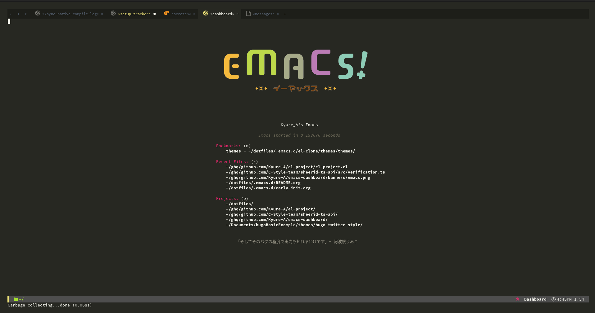

<div align="center">
	<h2>
		<a href="https://twitter.com/kyureq">@Kyure_A</a>'s Emacs (for Windows Subsystem for Linux)
	</h2>
</div>

- Shell:
	-  Windows: 
	 **pwsh** +  **Windows Terminal** +  **Starship**
	
	-  Linux: 
	 **zsh** +  **vterm** + 🐚 **Sheldon** +  **Starship**

- Editor:

   **Emacs** + 🍀 **leaf.el**



- Runtime manager: 
  - Rust: 
   rustup
  - Python: 
   Rye
  - Other: 
   rtx (alt asdf)

## Requirement
-  Git
  
-  zsh

-  Emacs

## Installation

To do the installation, all you have to do is copy and paste the only 1 lines of command below and run it.

```zsh
curl -sL https://dotfiles.kyre.moe/bin/installer.zsh | zsh
```

If zsh is not the default, you can run the command below. (This Installation commands are for zsh)

```zsh
chsh -s /bin/zsh
exec $SHELL -l
```

If you want to adapt the settings, restart the shell or run `exec $SHELL -l` .
